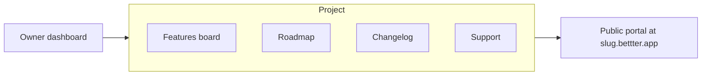

In Bettter, a **project** is the core unit of your account. It is not a generic workspace or folder — it is one complete feedback portal with its own address, four customer-facing tabs, and a settings panel to configure everything.

## Your portal address

Every project gets a unique subdomain:

```
{slug}.bettter.app
```

When you create a project, you choose a **slug** — the part before `.bettter.app`. Slugs must be lowercase letters, numbers, and hyphens only, between 1 and 32 characters. Reserved slugs such as `www`, `dashboard`, and `docs` are blocked.

<Info>
  On paid plans you can also connect a **custom domain** (for example `feedback.yourdomain.com`) instead of the default subdomain. See [Custom domain](/3.configure/3.6-custom-domain) for setup instructions.
</Info>

## Four modules

Each project includes four tabs that your customers see on the public portal. You manage all of them from the owner dashboard.

<Columns cols={2}>
  <Card title="Features" icon="lightbulb">
    **Owner:** Create, edit, and moderate feature requests. Filter by status including Pending.

    **Visitors:** Browse the board, suggest features, vote, and comment when enabled.
  </Card>
  <Card title="Roadmap" icon="map">
    **Owner:** Drag cards between Planned, In Development, and Shipped columns.

    **Visitors:** Read-only kanban view of your product direction.
  </Card>
  <Card title="Changelog" icon="scroll-text">
    **Owner:** Create, edit, and delete changelog entries.

    **Visitors:** Read-only timeline of product updates.
  </Card>
  <Card title="Support" icon="life-buoy">
    **Owner:** See where support tickets are sent.

    **Visitors:** Submit tickets through a contact form.
  </Card>
</Columns>

You can show or hide each tab individually in **Controls** within the settings panel. When a tab is disabled, visitors see a message that the page is disabled by the app owner.

## Settings panel

Open the settings panel from the project list at `/dashboard` — click **Add project** to create, or the gear icon on a project card to edit.

The panel opens as a right-side sheet with accordion sections. Each section has a dedicated page in [Configure](/3.configure/3.1-primary-settings):

<AccordionGroup>
  <Accordion title="Primary">
    Project name and slug (subdomain).
  </Accordion>
  <Accordion title="SEO">
    Website URL, SEO title, and meta description.
  </Accordion>
  <Accordion title="Branding">
    Brand color, theme, font, UI language, logo, favicon, and Open Graph image.
  </Accordion>
  <Accordion title="Support">
    Support email and descriptive message shown on the support form.
  </Accordion>
  <Accordion title="Custom domain">
    Connect and verify a custom hostname (paid plans).
  </Accordion>
  <Accordion title="Widget">
    Embed script, trigger button, and section toggles (paid plans).
  </Accordion>
  <Accordion title="Email notifications">
    Notification address and toggles for new features, comments, and status changes.
  </Accordion>
  <Accordion title="Controls">
    Tab visibility, open for voting, comments enabled, and shared navigation strip.
  </Accordion>
</AccordionGroup>

## Admin home is Features

<Note>
  There is no separate **Dashboard** tab inside a project. When you open a project from `/dashboard`, you land on its **Features** board at `/dashboard/[slug]`. Use the tab bar to switch to Roadmap, Changelog, or Support.
</Note>



You manage content in the **dashboard**. Your customers interact with the **public portal** at your subdomain or custom domain.

## Next

Continue to [Creating and managing projects](/1.getting-started/1.3-creating-and-managing-projects) to learn how to create, edit, open, and delete projects from the project list.
