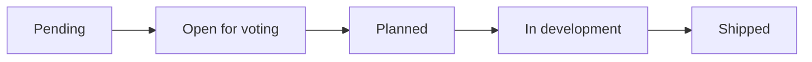

Every feature request has a **status** that controls where it appears on your board, roadmap, and public portal. As the owner, you can set any status. Visitor suggestions get an initial status based on your **Open for voting** setting.

## Status workflow

Statuses are not strictly linear — you can move a feature to any valid status at any time from the edit dialog.

## Status reference

| Status | Admin label | Public label | Where it appears |
|--------|-------------|--------------|------------------|
| `pending` | Pending | Hidden | Dashboard Features board only (owner filter) |
| `open-for-voting` | Voting | Open For Voting | Features board (admin + public) |
| `planned` | Planned | Planned | Features board + Roadmap (Planned column) |
| `in-development` | In Dev | In Development | Features board + Roadmap (In Development column) |
| `shipped` | Shipped | Shipped | Features board + Roadmap (Shipped column) |

## Visibility rules

<AccordionGroup>
  <Accordion title="Pending">
    Visible only to you on the dashboard Features board and detail pages. Hidden from the public board, roadmap, search, and direct URLs (public card URLs return 404).
  </Accordion>
  <Accordion title="Open for voting">
    Visible on the public Features board. Does not appear in roadmap columns — use Planned or later statuses for roadmap placement.
  </Accordion>
  <Accordion title="Planned, In development, Shipped">
    Visible on both the Features board and the Roadmap in their respective columns.
  </Accordion>
</AccordionGroup>

## Filtering

**Admin board filters:** All, Pending, Open for voting, Planned, In development, Shipped

**Public board filters:** All, Open for voting, Planned, In development, Shipped (no Pending option)

## Moving features through the workflow

Typical owner workflow:

1. Visitor suggests a feature → **Pending** (if open for voting is off) or **Open for voting** (if on)
2. Review pending suggestions → change to **Open for voting** to publish, or delete
3. Prioritize popular ideas → move to **Planned** with an expected delivery date
4. Start building → move to **In development**
5. Release → move to **Shipped**

You can also drag cards between roadmap columns — see [Moving cards with drag and drop](/2-manage-content/07-moving-cards-with-drag-and-drop).

## Next

Continue to [Voting](/2-manage-content/05-voting) to learn how voting works and how the Open for voting setting affects new suggestions.
