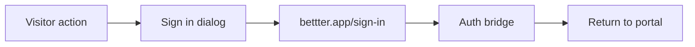

Portal sign-in uses the same Google authentication as the owner dashboard, but the session is scoped to visitor actions — not admin capabilities.

## When sign-in is prompted

Visitors are prompted to sign in when they try to:

- Suggest a feature
- Vote on a feature
- Post, like, or delete a comment

Browsing the board, roadmap, changelog, and support form does not require sign-in.

## Auth flow

<Steps>
  <Step title="Trigger a protected action">
    Visitor clicks Suggest, Vote, or Comment without being signed in. A dialog appears with **Sign in** and **Sign up** buttons.
  </Step>
  <Step title="Authenticate on apex">
    Bettter redirects to `bettter.app/sign-in` with a return URL pointing back to the portal page they were on.
  </Step>
  <Step title="Session handoff">
    After authentication, an auth bridge sets the session cookie on the portal host and redirects the visitor back to their original page.
  </Step>
  <Step title="Complete the action">
    The visitor can now suggest, vote, or comment. **Sign Out** appears in the top-right corner of tab pages.
  </Step>
</Steps>

Sign-in works on both `{slug}.bettter.app` and verified custom domains.

## Sign-in dialogs

| Context | Dialog title | Body |
|---------|-------------|------|
| Suggest / vote on board | Please sign up | Sign in or create an account to suggest features and vote. |
| Vote / comment on detail | Sign in to continue | Create an account or sign in to vote and comment on feature requests. |

Buttons: **Sign in**, **Sign up**, or dismiss.

## Sign out

When signed in, visitors see **Sign Out** in the top-right of portal tab pages (Features, Roadmap, Changelog, Support). Feature detail pages do not show Sign Out in the header.

- Click **Sign Out** → shows **Signing out…** while processing
- After sign-out, the visitor stays on the same portal page as a guest

## Portal session vs owner session

| Aspect | Public portal | Owner dashboard |
|--------|---------------|-----------------|
| Browse without login | Yes | No — `/dashboard` requires session |
| Auth provider | Google (NextAuth) | Same |
| Sign-in page | Apex via auth bridge | Apex with redirect to dashboard |
| Sign-out behavior | Stay on current portal page | Redirect to sign-in |
| Permissions | Vote, suggest, comment | Full CRUD, settings, moderation |

Signing in on the portal does **not** grant dashboard access. Only the project owner can manage content and settings from `/dashboard`.

<Note>
  The same Google account can be both a portal visitor and a project owner, but each context has separate permissions. Owner actions always require signing in at `bettter.app/dashboard`.
</Note>

## Next

You have completed the documentation. Return to the [documentation home](/) or explore the [Bettter demo portal](https://bettter.bettter.app) to see everything in action.
