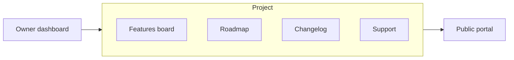

Bettter is a one-time-payment feedback platform for indie makers, SaaS founders, and product teams. You collect feature requests, share a public roadmap, publish a changelog, and offer support — without monthly subscription fees.

## What Bettter includes

Each **project** gives you four customer-facing modules and a settings panel to configure them.

<Columns cols={2}>
  <Card title="Features board" icon="lightbulb">
    Collect feature requests from customers. Let the most voted rise to the top.
  </Card>
  <Card title="Roadmap" icon="map">
    Show planned, in-development, and shipped work in one kanban-style view.
  </Card>
  <Card title="Changelog" icon="scroll-text">
    Share product updates and launches on a dedicated timeline page.
  </Card>
  <Card title="Support" icon="life-buoy">
    Give users a contact form that sends tickets to your support email.
  </Card>
</Columns>

## How a project fits together

<Note>
  A **project** is not a generic workspace. It is one complete feedback portal with its own subdomain (`{slug}.bettter.app`), four tabs, and all related settings.
</Note>

You manage content in the **dashboard** (owner admin area). Your customers interact with the **public portal** at your project subdomain or custom domain.

## Owner vs visitor

<AccordionGroup>
  <Accordion title="Owner dashboard">
    Sign in at [bettter.app/dashboard](https://bettter.app/dashboard) to create projects, edit settings, manage features, drag cards on the roadmap, and publish changelog entries. Opening a project lands on its Features board — there is no separate Dashboard tab inside a project.
  </Accordion>
  <Accordion title="Public portal">
    Visitors browse your feature board, read the roadmap and changelog, submit support tickets, and — when enabled — suggest features, vote, and comment after signing in. Pending features are visible only to you, not on the public board.
  </Accordion>
</AccordionGroup>

## Try it live

<Card title="Bettter demo portal" icon="external-link" href="https://bettter.bettter.app">
  Explore a live example of the feature board, roadmap, changelog, and support form.
</Card>

## Get started

<Steps>
  <Step title="Create an account">
    [Sign up](https://bettter.app/sign-up) and choose a lifetime plan (Basic, Pro, or Max).
  </Step>
  <Step title="Create a project">
    From `/dashboard`, create a project with a name and slug. Your portal will be available at `{slug}.bettter.app`.
  </Step>
  <Step title="Open your public portal">
    Use the project settings panel to configure branding, then open the public portal link to see what your customers will see.
  </Step>
</Steps>

<Check>
  After these three steps you have a working feedback portal you can share with users.
</Check>

## Pricing

<Info>
  All plans are one-time payments with lifetime updates:

  - **Basic** — $59, 1 project
  - **Pro** — $119, 5 projects
  - **Max** — $299, unlimited projects

  Every plan includes custom domain, unlimited users, features, changelog entries, and support tickets. See [pricing on the homepage](https://bettter.app/#pricing) for full details.
</Info>

## Next

Continue to [What is a project](/getting-started/what-is-a-project) to learn how the four modules and settings panel connect inside a single project.
